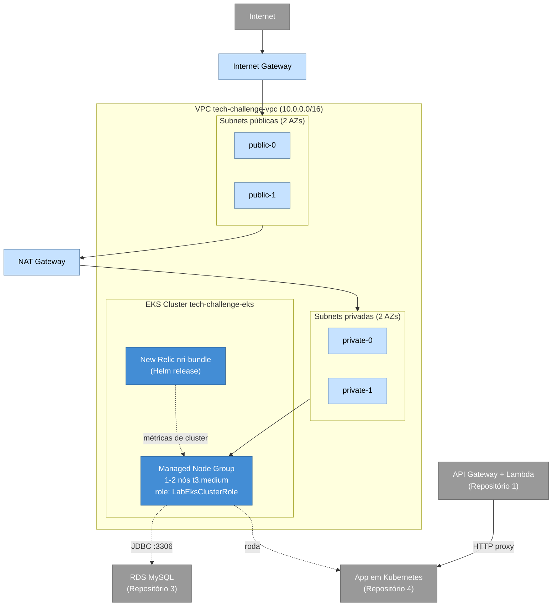

# fiap-tech-challenge-kubernetes-infrastructure

Infraestrutura de rede e cluster Kubernetes (Amazon EKS) do Tech Challenge Fase 3 — FIAP Pós-Tech, Arquitetura de Software, turma 13SOAT. Repositório 2 dos 4 exigidos pela Fase 3: provisiona, via Terraform, toda a infraestrutura de nuvem necessária para rodar a [aplicação principal](https://github.com/Adriana-Meyer/fiap-tech-challenge-pos-tech) em Kubernetes na AWS — exceto o banco de dados, que fica no [Repositório 3](https://github.com/Adriana-Meyer/fiap-tech-challenge-database-infrastructure), e a Lambda/API Gateway, que ficam no [Repositório 1](https://github.com/Adriana-Meyer/fiap-tech-challenge-API-gateway-function-serverless).

## Tecnologias

| Camada | Tecnologia |
|---|---|
| Provisionamento | Terraform >= 1.5, providers `hashicorp/aws`, `hashicorp/kubernetes`, `hashicorp/helm` |
| Nuvem | AWS (conta acadêmica AWS Academy Learner Lab) |
| Rede | VPC própria, subnets públicas/privadas em 2 AZs, 1 NAT Gateway |
| Cluster | Amazon EKS (Managed Node Group) |
| Observabilidade de cluster | New Relic Kubernetes integration (`nri-bundle`, via Helm) |
| CI/CD | GitHub Actions |

## Arquitetura



**Decisões de desenho** (detalhadas nos ADRs/RFCs centralizados no repositório da App, pasta [`docs/`](https://github.com/Adriana-Meyer/fiap-tech-challenge-pos-tech/tree/main/docs)):
- Cluster e Node Group usam o role `LabEksClusterRole` já existente na conta AWS Academy — o Learner Lab não permite criar roles/políticas IAM novos.
- 1 único NAT Gateway (não um por AZ) para reduzir custo — aceitável para um projeto acadêmico.
- Node Group limitado a no máximo 2 instâncias `t3.medium`: o Learner Lab tem um teto de 9 instâncias EC2 simultâneas e 32 vCPUs na conta inteira (20+ instâncias derruba a conta), então o node group precisa deixar folga para outros usos eventuais de EC2.
- VPC e subnets recebem tags fixas (`Name`, `Tier=public/private`) e o cluster tem um nome fixo (`tech-challenge-eks`) para o Repositório 3 conseguir localizar a rede e o security group do cluster via `data source` do Terraform, sem precisar copiar valores manualmente entre repositórios.
- A integração do New Relic com o Kubernetes (`nri-bundle`) fica neste repositório por ser infraestrutura de cluster, não da aplicação — o `helm_release` só é criado quando a variável `new_relic_license_key` é definida (evita quebrar o `apply` antes da etapa de observabilidade).

## Pré-requisitos

- Terraform >= 1.5
- Conta AWS Academy Learner Lab **ativa** (sessão de 4h) com credenciais temporárias exportadas
- AWS CLI e `kubectl` (para validar o cluster depois de provisionado)

## Executando

```bash
export AWS_ACCESS_KEY_ID=...
export AWS_SECRET_ACCESS_KEY=...
export AWS_SESSION_TOKEN=...

terraform init
terraform plan
terraform apply

# Configurar o kubectl para apontar para o cluster recém-criado
$(terraform output -raw kubeconfig_command)
kubectl get nodes
```

Para desativar tudo ao final da sessão de estudo (economiza orçamento do Lab):

```bash
terraform destroy
```

## CI/CD

- **`terraform-validate.yml`** — roda em todo push/PR para `develop`/`main`: `terraform fmt -check`, `terraform init -backend=false`, `terraform validate`. Não precisa de credenciais AWS.
- **`terraform-apply.yml`** — disparo manual (`workflow_dispatch`), com escolha entre `plan`/`apply`/`destroy`. Usa credenciais temporárias da sessão AWS Academy, fornecidas via GitHub Secrets (`AWS_ACCESS_KEY_ID`, `AWS_SECRET_ACCESS_KEY`, `AWS_SESSION_TOKEN`) — precisam ser atualizadas a cada nova sessão do Lab (expiram em ~4h). Fica manual durante o desenvolvimento; passa a rodar automaticamente no push para `main` mais perto da entrega final do projeto.

## Variáveis Terraform

Todas têm valor padrão (ver [`variables.tf`](variables.tf)); a única que normalmente precisa ser definida é:

| Variável | Descrição |
|---|---|
| `new_relic_license_key` | License key de ingestão do New Relic — enquanto vazia, a integração de Kubernetes (`nri-bundle`) não é criada |

## APIs

Este repositório não expõe API própria — é infraestrutura de plataforma. A documentação Swagger da aplicação está no [Repositório 4](https://github.com/Adriana-Meyer/fiap-tech-challenge-pos-tech#documenta%C3%A7%C3%A3o-da-api-swagger-ui).
